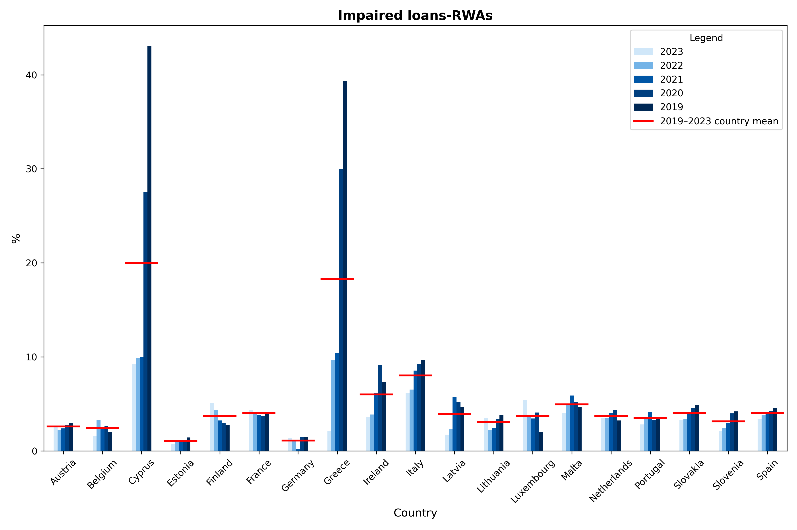
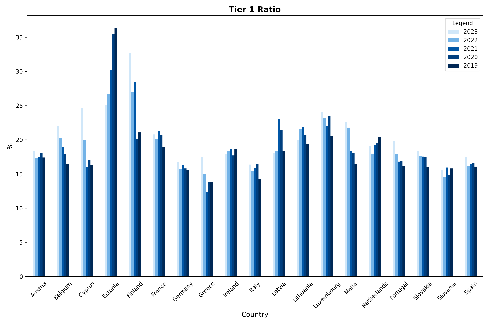
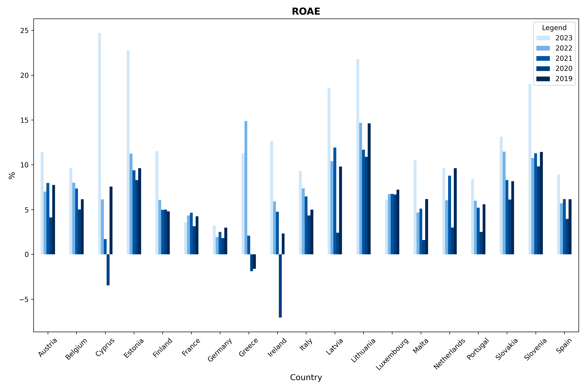

# European Banking Performance Analysis: Capital, Profitability and Asset Quality, 2019-2023

**How did capitalisation, profitability and asset quality evolve across a sample of European banks between 2019 and 2023?**

This project analyzes **436 banks across 19 EU/EEA countries** along three
dimensions:
- **Capitalisation**: Tier 1 Capital, Tier 1 Ratio, Total Capital Adequacy Ratio
- **Profitability**: ROAA, ROAE, Net Interest Income
- **Asset quality**: Impaired loans, Impaired loans as a % of risk-weighted
  assets (a project-specific asset-quality ratio — not the standard NPL
  ratio, which is normally impaired/non-performing loans over gross loans;
  see [`data/README.md`](data/README.md))

Data source: BankFocus (Moody's/Bureau van Dijk) bank-level export,
2019-2023. See [`data/README.md`](data/README.md) for the full data
dictionary, including per-country bank counts.

## Data license note

**`data/data.xlsx`, `output_clean.xlsx`, `outlier_report.csv` and
`balanced_panel_report.csv` are all excluded from version control by
default** (see `.gitignore`). This is not just about the raw export:
`outlier_report.csv` alone contains 1,506 individually identified bank
names and financial values drawn directly from the licensed BankFocus
data, and the other two files are derived from it just as directly.
Excluding only the raw `data.xlsx` would not be enough — a reader could
reconstruct a large part of the underlying licensed data from those
derived files alone. `coverage_report.csv` (bank *counts* only, no names or
values) is left trackable, but reassess that too if your license is
stricter than that.

BankFocus is a proprietary, subscription-based database; whether any of
this data can be redistributed publicly depends on your university's
license terms, which this project has not verified. Before publishing this
repository with any of the files above included:
- check your institution's BankFocus/Moody's license for redistribution
  clauses (covering both raw and derived/aggregated data), or
- publish the code, documentation and charts only, and let others reproduce
  the analysis with their own BankFocus access, or
- replace `data/data.xlsx` with a small anonymized or synthetic sample for
  demonstration purposes, and regenerate the derived files from that
  instead.

## Repository structure

```
european-banking-performance-analysis/
├── README.md
├── LICENSE                      <- MIT (code only -- see license note above)
├── requirements.txt
├── data/
│   ├── README.md                <- data dictionary + coverage table
│   ├── data.xlsx                <- raw bank-level export (gitignored by default)
│   ├── output_clean.xlsx        <- cleaned, country-aggregated data (gitignored by default)
│   ├── outlier_report.csv       <- flagged outliers, bank name + IQR bounds (gitignored by default)
│   ├── coverage_report.csv      <- bank count per country/year/indicator (no names/values -- trackable)
│   └── balanced_panel_report.csv <- full-sample vs. fixed-panel totals (gitignored by default)
├── notebooks/
│   └── european_banking_performance.ipynb
├── src/
│   ├── aggregation.py           <- per-indicator aggregation rules
│   ├── data_cleaning.py         <- ExcelTool: read, clean, aggregate
│   └── visualization.py         <- chart generation
├── tests/
│   └── test_pipeline.py         <- pytest unit tests for aggregation/cleaning
└── outputs/
    └── figures/                 <- one PNG per indicator
```

## Methodology

The core methodological choice in this project is that **absolute monetary
variables and ratio variables cannot be aggregated the same way**:

- **Tier 1 Capital, NII, Impaired loans** (reported in the raw data in EUR
  — not thousands, verified against the source column headers) are
  **summed** across banks within a country-year. Charts display these in
  **EUR billions** for readability.
- **Tier 1 Ratio, Total Capital Adequacy Ratio, ROAA, ROAE, NII/RWA,
  Impaired loans/RWA** (percentages) are aggregated as a **median** because
  it is less sensitive to extreme bank-level observations. Since reliable
  asset or RWA weights were unavailable, a system-wide weighted average
  could not be calculated instead. This means these columns describe the
  **representative bank** in each country's sample, not a system-wide
  weighted average.

Full rationale in [`src/aggregation.py`](src/aggregation.py).

Further choices, aimed at not distorting the data silently:

- **Missing values** are kept as `NaN` by default rather than imputed —
  missing rates range from 11% to 38% depending on the indicator.
- **Outliers** are detected with the IQR method **separately for each
  country and year** — comparing a bank only to its peers in the same
  country, not to the whole European sample, so a large German or French
  bank isn't flagged merely for being bigger than a typical Estonian one.
  Every flagged value is written to `data/outlier_report.csv` **with the
  bank name, country, year and the IQR bounds that triggered the flag**, so
  it can be traced and reviewed case by case. Rows are never removed
  automatically. Note that this per-country/year method flags an
  individual bank that stands out from its national peers in a given year
  — it will *not* flag an entire country's level as unusual relative to
  the rest of Europe (that pattern is visible in the aggregated
  country-level charts instead, e.g. Cyprus/Greece's elevated
  impaired-loans-to-RWA ratio in
  2019-2020, since most banks within those countries shared it).
- **Bank coverage** varies enormously by country and indicator — from 2-4
  banks (Estonia, Lithuania) up to 106 banks reporting in a single
  country-year cell (France). `data/coverage_report.csv` records exactly
  how many banks back every country-year-indicator cell. Giving Estonia's
  median the same standing as France's median in a cross-country
  comparison is a real, debatable choice, not a hidden one.
- **Balanced-panel check**: for the summed (absolute) indicators,
  `data/balanced_panel_report.csv` compares the full-sample total to a
  total computed only from banks that reported in **all 5 years**, so a
  reader can see how much of a change in a total is attributable to a
  changing set of reporting banks rather than genuine growth (see
  Limitations).

## Coverage

19 countries, 436 banks: AT, BE, CY, DE, EE, ES, FI, FR, GR, IE, IT, LT, LU,
LV, MT, NL, PT, SI, SK. The number of banks actually backing a given
country-year cell ranges from 2 (Estonia) to 106 (France) — see
[`data/coverage_report.csv`](data/coverage_report.csv) and the coverage
table in the data dictionary for exact, per-country figures (do not rely on
a single "X to Y banks" headline number — it varies by indicator and year).

## Results

Charts for all 9 indicators are in [`outputs/figures/`](outputs/figures/).
Three of them, inline:





Descriptive highlights (cross-country medians, unless noted):

- **Asset quality** (Impaired loans/RWA) shows the clearest convergence
  pattern: Cyprus (43.1% → 9.3%) and Greece (39.3% → 2.1%) started 2019 with
  ratios far above the rest of the sample and converged sharply by 2023,
  while the cross-country median stayed low and stable (4.1% → 3.4%).
- **Capitalisation** (Tier 1 Ratio, Total Capital Adequacy Ratio) increased
  overall between 2019 and 2023, though not monotonically: the
  cross-country median Tier 1 Ratio went 16.5% (2019) → 17.9% (2020) →
  18.4% (2021) → 18.3% (2022, a small dip) → 19.2% (2023); median Total
  Capital Adequacy Ratio followed a similar path from 19.0% to 20.9%. No
  statistical test for a break or trend has been run, so this is a
  descriptive observation, not a causal claim.
- **Profitability** (ROAE, ROAA) dipped in 2020 (median ROAE 6.2% → 4.0%,
  median ROAA 0.55% → 0.31%), consistent with pandemic-related provisioning,
  then recovered and rose sharply by 2023 (median ROAE 11.3%, ROAA 1.04%)
  alongside the rising-rate environment.

## Limitations

- Ratio indicators describe the representative bank in each country's
  sample, not a weighted system-wide average (no RWA/asset weights were
  available).
- Bank coverage varies enormously by country and indicator (2 to 106 banks
  per country-year cell) — see `data/coverage_report.csv` before treating
  any single country's median as equally reliable.
- The number of banks reporting a given indicator changes from year to year
  within a country. This means a change in a **summed** total (e.g. Tier 1
  Capital) can partly reflect a change in how many banks reported that
  year, not only genuine growth. `data/balanced_panel_report.csv` compares
  the full-sample total against a fixed panel of banks present in all 5
  years for every country — e.g. for France's Tier 1 Capital, between 85
  and 88 banks report a value in any single year, but only 77 of those
  report in every single year; comparing the two totals side by side
  shows how much of the trend survives once the panel is held fixed. This
  is a partial check, not a full fix (the fixed panel is itself a
  selection of larger, more consistently-reporting banks, which can bias
  it toward bigger institutions).
- Missing data (up to 38% for some indicators) means country-year cells are
  based on different, and sometimes small, numbers of reporting banks.
- Outliers are flagged (per country/year, with bank name and IQR bounds)
  but not excluded from the charts; some very high values are genuine data
  points (e.g. small specialised banks with >80% capital ratios), not
  errors, but can visually dominate a chart.
- The asset-quality indicator "Impaired loans-RWAs" is impaired loans as a
  percentage of risk-weighted assets, not the standard NPL ratio (usually
  non-performing loans over gross loans) — the two move similarly but are
  not interchangeable; this project uses the label the source data
  provides.
- This is a descriptive comparison across countries and years, not a
  regression or causal analysis, and no statistical significance testing has
  been performed on any of the trends described above. For a
  regression-based analysis, see the companion project
  `monetary-policy-banking-analysis`, which studies the relationship
  between ECB monetary policy and bank indicators via panel regression.

## Reproducing the analysis

Paths are resolved relative to the script location (not the current working
directory), so both of these work:

```bash
pip install -r requirements.txt

# from the repository root
python src/data_cleaning.py
python src/visualization.py

# or, equivalently, from inside src/
cd src
python data_cleaning.py
python visualization.py
```

Or open `notebooks/european_banking_performance.ipynb` to run the full
pipeline interactively with explanations.

Run the test suite with:
```bash
pytest tests/
```
